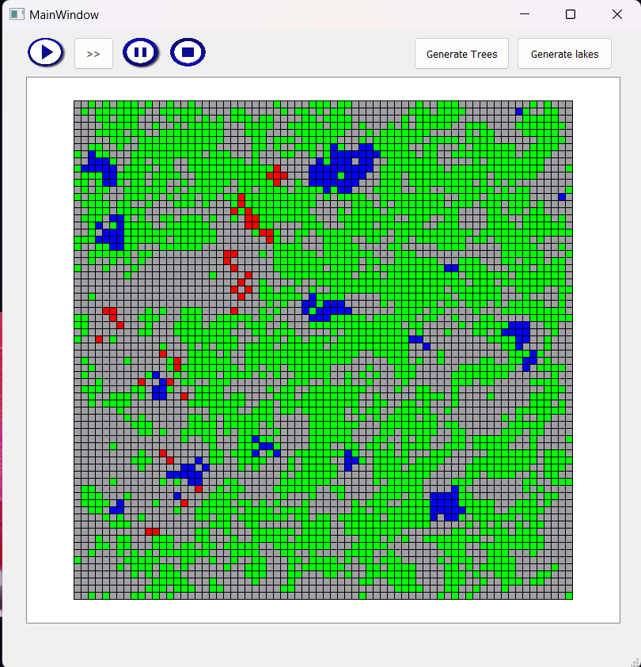
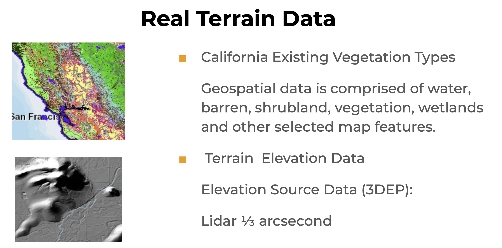
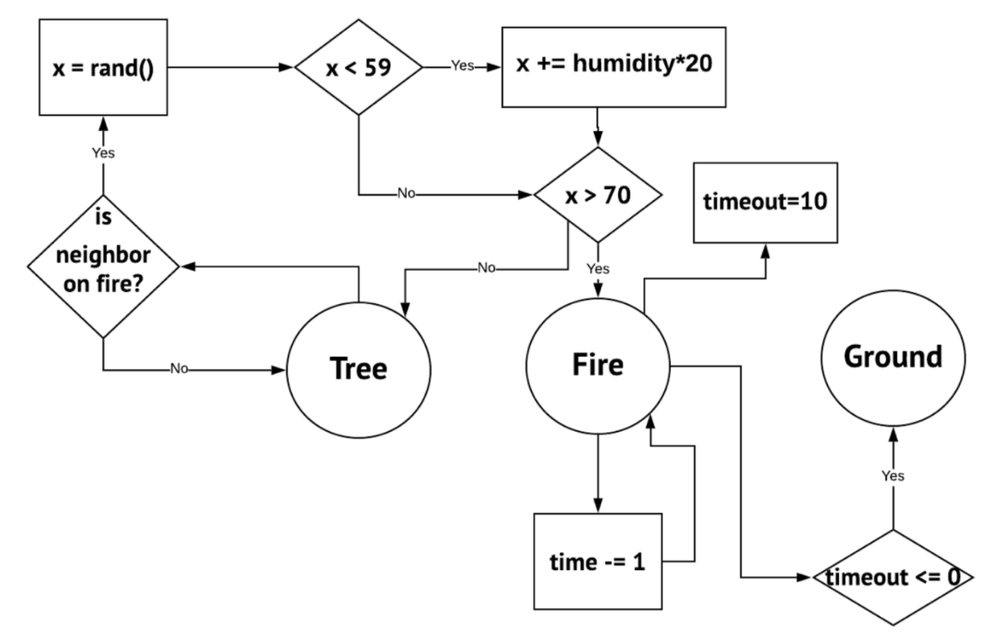

# Firesim
## Abstract

 Wildfires simulation – one of the challenging tasks in natural disaster forecast problems. There are many issues that make this problem harder like unavailability of detailed terrain data, not enough wildfire history data (in order to solve this problem through statistical inference), computational resources required for large-scale, high resolution simulations and one universal framework for testing different fire models and incorporation of different terrain and weather data sources. 

 There are different governmental open datasets which contain different terrain GIS data and numerous weather prediction models. In addition, there are state-of-the-art fire prediction models which are currently in use by the different agencies which deal with wildfires. Next, by finding optimal point between scale of the simulation and resolution, we can fit any available computational resources. Finally, the issue of standardization of different fire models and aggregating all the data that can be useful for fire simulation is indeed the goal of this project. 

 Given that such framework would adequately simulate wildfires, there is a range of possible extensions to such project like training autonomous fire-fighting agents. 

Contact info: adilnaut@gmail.com , armansabyrov@gmail.com

## Installation
1. Install dependencies  
   a. GDAL - https://gdal.org/download.html  
   b. GLUT - https://www.opengl.org/resources/libraries/glut/  
   c. WxWidget - https://docs.wxwidgets.org/trunk/plat_msw_install.html  
2. Download Elevation and Existing Vegetation Types data here and move to terrain_data folder:
   UPD: because of the wxWidget bug, paste your data path directly in scrolledcanvas.cc  
   Landfire data products - https://www.landfire.gov/index.php
3. Run compile.sh

## System design and architecture

### Py Demo
The very first iteration of the idea was a game-of-life type fire simulation strategy using matplotlib and numpy.

### Bonfire
Next, using the basic idea of game-of-life type fire simulation and adding simple pre-defined rules, Adilet build C++ desktop application for simulation of a fire from user tagged starting position with
step by step propagation. In addition user could generate lakes and more trees.
 

### Terrain

Then, both Adilet and Arman started to build a real world terrain import and visualization modules.  
 

 In order to get convincing results of fire model, we choose two types of data to include in calculation of the fire. Those are elevation data, which is data from lidar sensors in .dem format, and shapefiles, which contains terrain information such as water, tree, ground and grass.

 DEM or digital elevation model are derived from lidar point cloud source. Point clouds are a collection of points that represent a 3D shape or feature. Each point has its own set of X, Y and Z coordinates and in some cases additional attributes. LiDAR sensors can be mounted to aerial vehicles to send laser pulses to the Earth’s surface and once the laser returns back to the sensor, the LiDAR system will record data based on information received, so to collect information about the shape of the Earth and its features. We used 1/3 arc-second precise data, which is is the highest resolution seamless DEM dataset. This data was downloaded on official website of United States Geological Survey (USGS). 

 In addition, this organization also provide shapefiles of US territory. These shapefiles weren't used because of its complicated structure. Therefore, we used another data with clearer shapes (polygons) and information. LANDFIRE's (LF) Existing Vegetation Type (EVT) represents the current distribution of the terrestrial ecological systems classification, developed by NatureServe for the western hemisphere. The data contained 1000 vegetation/fuel types which was mapped into 6 basic types, that we used in calculations. 

 The area we worked on is from -122.000556; 38.000556 to -121.010556; 37.010556, which is west to San Francisco.
In the earlier stages of the project, it was also planned to use Woodland Shapefiles. However, because we were not satisfied with the resolution of the data (the shapefiles were significant only at the large scale (dozen kilometers), however our elevation data were significant at more higher resolution 1/3 arcsecond). Therefore, we substituted our shapefiles dataset which indicated regions of the woodland data, with raster (ArcGIS) Existing Vegetation Types with 1000 labels which was described above.

### The Fire Simulation Engine

 The main value of the simulation in regards to the framework for the autonomous fire-fighting models is variability of the different environment and situations which will train agents for the dealing with real-life fires. Therefore, it was decided to make fire models probabilistic and at the same time the probability was conditional to the humidity which is defined by distance to the water source and to the fire on the neighboring cells. 

 One of the version of our fire models can be seen on the figure below: 

Picture 1. Diagram of the initial fire model.

 Our next version of the fire model was designed to utilize the elevation data and vegetation type. 

## References

1.  Ravi N. Haksar, Mac Schwager. “Distributed Deep Reinforcement Learning for Fighting Forest Fires with a Network of Aerial Robots”. Multi-robot System Lab.https://web.stanford.edu/~schwager/MyPapers/HaksarSchwagerIROS18DRLFirefighting.pdf  

2. US Geological Survey. https://www.usgs.gov/ 

3. Data download Application by USGS. https://viewer.nationalmap.gov/basic/ 

4. FLogA 2.0 Wildifre simulation https://www.youtube.com/watch?v=u7h72XwPKFs 

